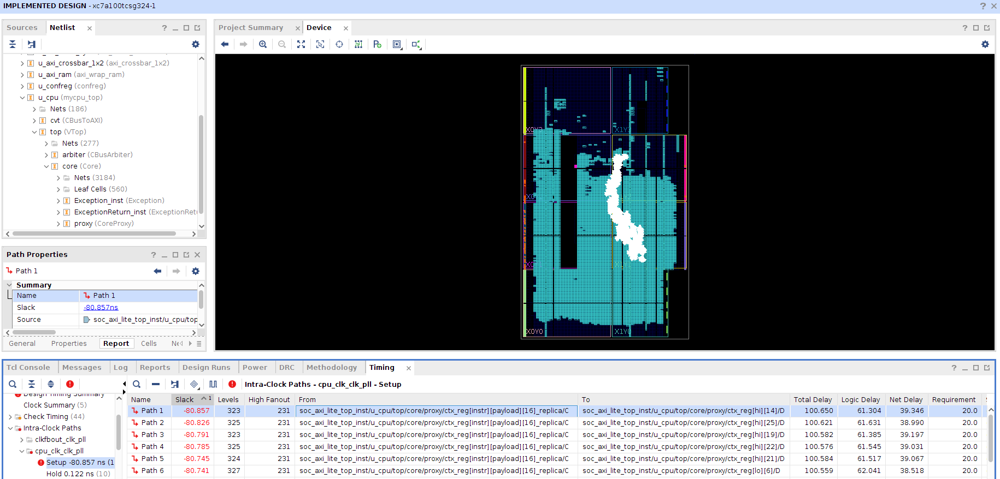

# 实验 2b：乘除法指令

增加乘除法指令和 `HI`、`LO` 寄存器，上板通过 `test3` 的测试。请自行翻阅[指令列表](../misc/instruction.md)和 [MIPS 指令手册](../misc/external.md#mips-架构)。

## 基本实现

两个 32 位数相乘的结果是 64 位，相除的结果包括 32 位商和 32 位余数。

MIPS 引入两个新的 32 位寄存器：`HI` 和 `LO` 来存储这 64 位结果。

这两个的寄存器写法和通用寄存器类似：

```verilog
module hilo (
    input logic clk,
	output i32 hi, lo,
    input i1 hi_write, lo_write,
    input i32 hi_data, lo_data
);
    i32 hi_new, lo_new;
    always_comb begin
        {hi_new, lo_new} = {hi, lo};
        if (hi_write) begin
            hi_new = hi_data;
        end
        if (lo_write) begin
            lo_new = lo_data;
        end
    end
    always_ff @(posedge clk) begin
        {hi, lo} <= {hi_new, lo_new};
    end
endmodule
```

以下是单周期乘除法器的一个参考写法：

```verilog
module mult (
    input i32 a, b,
    input decoded_op_t op,
    output i32 hi, lo
);
    i64 ans;
    always_comb begin
        case (op)
            MULTU: begin
                ans = {32'b0, a} * {32'b0, b};
                hi = ans[63:32]; lo = ans[31:0];
            end
            MULT: begin
                ans = signed'({{32{a[31]}}, a}) * signed'({{32{b[31]}}, b});
                hi = ans[63:32]; lo = ans[31:0];
            end
            DIVU: begin
                ans = '0;
                lo = {1'b0, a} / {1'b0, b};
                hi = {1'b0, a} % {1'b0, b};
            end
            DIV: begin
                ans = '0;
                lo = signed'(a) / signed'(b);
                hi = signed'(a) % signed'(b);
            end
            default: begin
                {hi, lo, ans} = '0;
            end
        endcase
    end
endmodule
```

## \*多周期乘除法器

> 参见：“Computer Architecture: A Quantitative Approach (6th Edition)”: Appendix J

32 位乘除法器的逻辑十分复杂，其单周期的实现延迟极高。

RefCPU 采用了单周期乘除法器。打开 `test5` 的 Vivado 工程 → 添加源文件 → “Run Implemented Design” → “Open Implemented Design”，查看延迟最高的一条路径，可得到下图中的信息：



延迟最高的几条路径的终点都是 `HI` 和 `LO` 寄存器。这是除法操作的数据路径，逻辑级数高达 300，延迟高达 100ns，这就把 CPU 的频率限制在了 10MHz 以下。

实现乘除法器前，我们的五级流水线大概可达到 80MHz（关键路径的延迟约为 12ns）。如此大幅度的频率下滑，难以令人满意。我们已经划分了单周期 CPU 的数据通路（通过流水线），现在我们来划分一下乘法器和除法器，让单条乘除法指令在多个周期里执行。

让乘除法在多个周期里完成，会影响 IPC，但乘除法指令出现的频率很低，总体 IPC 的变化很小。而频率的下降会影响每条指令的执行效率。以下是一个简单的性能分析：

> 某程序有 500 条指令（无分支跳转），其中 10 条是除法指令，其余指令的数据通路延迟都很低。
>
> * 使用单周期除法器的 CPU，时钟周期为 100ns，运行这个程序需要约 500 个周期，即 50,000ns。
> * 使用多周期除法器的 CPU，时钟周期为 12ns，除法指令需要 50 个周期执行，运行这个程序需要约 1000 个周期，即 12,000ns。

### 乘法器

一种借用了竖式乘法的单周期乘法器（参考书 J.2 章节），实现如下：

```verilog
module multiplier_singlecycle (
	input i32 a, b,
    output i64 c // c = a * b
);
    i65 p;
    always_comb begin
        p[31:0] = a;
        p[64:32] = '0;
        for (int i = 0; i < 32; i++) begin
            if (p[0]) begin // 每次循环扫a的一位
                p[64:32] = p[63:32] + b; // 如果是1则加上b
                // p[64:32] = p[64:32] + b; 更快
            end
            p = {1'b0, p[64:1]}; // 整体右移，需要检查的下一位被移至p[0]
        end
    end
    assign c = p[63:0];
endmodule
```

这种方法的延迟约为 60ns。用注释里的那句语句，延迟约为 47ns（注释里的是 33 位加法，为什么比用 32 位加法更快？）。用乘法运算符实现单周期乘法时，Vivado 会调用实验板上的特殊运算资源 DSP，延迟约为 10ns。

这种方法有**每一步**的概念，可以很方便地拆分成多周期：每个时钟周期执行 1 次（或更多次）循环即可。另外，多周期乘法器需要一个计数器，记录乘法已进行的周期数。

```verilog
module multiplier_multicycle_from_single (
    input logic clk, resetn, valid,
	input i32 a, b,
    output logic done, // 握手信号，done 上升沿时的输出是有效的
    output i64 c // c = a * b
);
    enum i1 { INIT, DOING } state, state_nxt;
    i35 count, count_nxt;
    localparam i35 MULT_DELAY = {'0, 1'b1, 32'b0};
    always_ff @(posedge clk) begin
        if (~resetn) begin
            {state, count} <= '0;
        end else begin
            {state, count} <= {state_nxt, count_nxt};
        end
    end
    assign done = (state_nxt == INIT);
    always_comb begin
        {state_nxt, count_nxt} = {state, count}; // default
        unique case(state)
            INIT: begin
                if (valid) begin
                    state_nxt = DOING;
                    count_nxt = MULT_DELAY;
                end
            end
            DOING: begin
                count_nxt = {1'b0, count_nxt[34:1]};
                if (count_nxt == '0) begin
                    state_nxt = INIT;
                end
            end
        endcase
    end
    i65 p, p_nxt;
    always_comb begin
        p_nxt = p;
        unique case(state)
            INIT: begin
                p_nxt = {'0, a};
            end
            DOING: begin
                if (p_nxt[0]) begin
                    p_nxt[64:32] = p_nxt[63:32] + b;
                    // p_nxt[64:32] = p_nxt[64:32] + b;
            	end
            	p_nxt = {1'b0, p_nxt[64:1]};
            end
        endcase
    end
    always_ff @(posedge clk) begin
        if (~resetn) begin
            p <= '0;
        end else begin
            p <= p_nxt;
        end
    end
    assign c = p[63:0];
endmodule
```

本方法延迟约为 3.6ns（一个 32 位加法）。用注释里的那句语句，延迟约为 3ns。如果每周期做 4 次加法，周期数从 32 降至 8，延迟增加至 7.8ns。

本方法使用了 32 层加法器实现了乘法。如果是 $n$ 位无符号数的乘法，本方法使用的加法器层数为 $\mathrm O(n)$。Wallace tree 和 signed-digit tree 是加法器层数为 $\mathrm O(\log n)$ 的算法，如果你对此感兴趣，可以查阅参考书 J.9 章节。

然而，我们发现，利用 DSP 资源，单周期乘法的性能已经不错了。


上图为使用 DSP 资源的单周期乘法器的关键路径。左侧的两个端口很多的元件 `DSP48E1` 即为 DSP ，右侧的若干 `CARRY4` 为加法逻辑。每片 `DSP48E1` 内置一个 25 位乘 18 位的乘法器，集成了乘加 $a \times b + c$ 的功能。

如果你想用 DSP 实现乘法器，请查阅 `DSP48E1` 的有关资料与手册。

Vivado 在解析乘法运算符时，默认采用 DSP 实现。我们可以将 32 位的乘法拆成若干个乘法，使每个乘法的位宽可以被 DSP 内置的乘法器所容纳，然后再将这些乘积进行移位相加。这样，在使用乘法运算符时，综合器就会简单地采用 DSP 中的乘法器。

下面的代码是一个简单的实现方案：将 32 位的乘法拆成四部分，两个乘数的前 16 位和后 16 位分别相乘，这样就是四个 16 位的乘法，可以用上 DSP 的乘法器。最后的加法里，两个低 16 位相乘的结果无需移位，高 16 位乘低 16 位的结果需要左移 16 位，两个高 16 位相乘的结果需要左移 32 位：

```verilog
// c = (a[31:16] * b[31:16] << 32) + (a[15:0] * b[31:16] << 16) +
//     (a[31:16] * b[15:0] << 32) + (a[15:0] * b[15:0])
module multiplier_multicycle_dsp (
    input logic clk, resetn, valid,
	input i32 a, b,
    output logic done,
    output i64 c // c = a * b
);
    logic [3:0][31:0]p, p_nxt;
    assign p_nxt[0] = a[15:0] * b[15:0];
    assign p_nxt[1] = a[15:0] * b[31:16];
    assign p_nxt[2] = a[31:16] * b[15:0];
    assign p_nxt[3] = a[31:16] * b[31:16];

    always_ff @(posedge clk) begin
        if (~resetn) begin
            p <= '0;
        end else begin
            p <= p_nxt;
        end
    end
    logic [3:0][63:0] q;
    assign q[0] = {p[0]};
    assign q[1] = {p[1], 16'b0};
    assign q[2] = {p[2], 16'b0};
    assign q[3] = {p[3], 32'b0};
    assign c = q[0] + q[1] + q[2] + q[3];

    enum logic {INIT, DOING} state, state_nxt;
    always_ff @(posedge clk) begin
        if (~resetn) begin
            state <= INIT;
        end else begin
            state <= state_nxt;
        end
    end
    always_comb begin
        state_nxt = state;
        if (state == DOING) begin
            state_nxt = INIT;
        end else if (valid) begin
            state_nxt = DOING;
        end
    end
    assign done = state_nxt == INIT;
endmodule
```

本方法延迟约为 5.3ns，需要两个周期：第一个周期做四个并行的 16 位乘法（关键路径，延迟约为 5.3ns），第二个周期做剩余的加法（延迟约为 4.6ns）。这个方法用单周期实现，延迟约为 9.6ns。在接入流水线时，可能需要加一级输入寄存器。

本方法仅利用了 DSP 的乘法器和一层寄存器（经检测，乘法结果的那一级寄存器没有使用额外资源），没有利用乘加的功能，16 位的划分也不一定是最优方案，但性能已经令人满意。

### 除法器

一种借用了竖式除法的单周期除法器（参考书 J.2 章节），实现如下：

```verilog
module divider_singlecycle (
	input i32 a, b,
    output i64 c // c = {a % b, a / b}
);
    i64 p;
    always_comb begin
        p = {'0, a};
        for (int i = 0; i < 32; i++) begin
            p = {p[63:0], 1'b0};
            if (p[63:32] >= b) begin
                p[63:32] -= b;
                p[0] = 1'b1;
            end
        end
    end

    assign c = p;
endmodule
```

本方法延迟约为 93ns（直接用除法运算符的单周期除法器延迟约为 80ns）。

类似地，可以将它拆分成多周期：

```verilog
module divider_multicycle_from_single (
    input logic clk, resetn, valid,
	input i32 a, b,
    output logic done,
    output i64 c // c = {a % b, a / b}
);
    enum i1 { INIT, DOING } state, state_nxt;
    i35 count, count_nxt;
    localparam i35 DIV_DELAY = {'0, 1'b1, 32'b0};
    always_ff @(posedge clk) begin
        if (~resetn) begin
            {state, count} <= '0;
        end else begin
            {state, count} <= {state_nxt, count_nxt};
        end
    end
    assign done = (state_nxt == INIT);
    always_comb begin
        {state_nxt, count_nxt} = {state, count}; // default
        unique case(state)
            INIT: begin
                if (valid) begin
                    state_nxt = DOING;
                    count_nxt = DIV_DELAY;
                end
            end
            DOING: begin
                count_nxt = {1'b0, count_nxt[34:1]};
                if (count_nxt == '0) begin
                    state_nxt = INIT;
                end
            end
        endcase
    end
    i64 p, p_nxt;
    always_comb begin
        p_nxt = p;
        unique case(state)
            INIT: begin
                p_nxt = {'0, a};
            end
            DOING: begin
                p_nxt = {p_nxt[63:0], 1'b0};
                if (p_nxt[63:32] >= b) begin
                    p_nxt[63:32] -= b;
                    p_nxt[0] = 1'b1;
                end
            end
        endcase
    end
    always_ff @(posedge clk) begin
        if (~resetn) begin
            p <= '0;
        end else begin
            p <= p_nxt;
        end
    end
    assign c = p;
endmodule
```

本方法延迟约为 3.6ns ，周期数为 32。

### 有符号数的处理

上面提到的所有实现，都是针对无符号数的，没有考虑有符号数的符号位。

对于有符号数的乘除法，一种简单的处理方法是将有符号数取绝对值，再进行乘除法，最后再恢复符号位，这样就可以复用无符号数的乘除法器了。

乘法的转换比较简单，这里仅举一个例子：当 $a < 0, b > 0$ 时，$c = a \times b = -(-a) \times b$。

除法的处理复杂一些：
$$
|a| = |bq| + |r| \implies
\begin{cases}
a = (-b)(-q) + r & (a > 0, b < 0) \\
-a = b(-q) + (-r) & (a < 0, b > 0)
\end{cases}
$$

### 流水线控制逻辑

如果你采用了多周期的乘除法器，那么你需要在流水线的控制逻辑里，添加新的阻塞条件。

一个简单的实现是，遇到乘除法指令时，阻塞流水线至其计算完毕。

MIPS 将乘除法指令的结果写入 `HI` 和 `LO` 寄存器，而非通用寄存器，并通过 `MFLO` 和 `MFHI` 来读取结果到通用寄存器内。编译器有时会在乘除法指令后插入几条不相关的普通指令，再用 `MFLO` 和 `MFHI` 来读取结果。这样，在计算乘除法结果的这几个周期里，流水线可以继续执行；遇到接下来的第一条 `MFLO` 或 `MFHI` 时，如果没计算完毕，再阻塞；如果已计算完毕，就直接读取结果，相当于乘除法指令没有造成任何阻塞。这是一种潜在的优化，优化的效果取决于编译器。

## 实验提交

**本实验和实验 2a 一起提交。**

### 通过标准

* 上板通过 `test3` 的测试。

### 截止时间

**2021 年 4 月 11 日 23:59:59**

## \*思考题

1. 李四发现 Verilator 仿真的 CONFREG 模块提供了简单的串口交互接口：地址 `0xbfaf1000` 用于在串口上读写字符，地址 `0xbfaf1014` 用于检查是否有未读入的字符。于是李四在 `misc/echo` 下编写了一个汇编程序 `echo.s`，它会把你在终端上输入的字符显示出来。请先尝试将 `echo.s` 编译成 `.coe` 文件。

    打开一个终端，在仓库根目录下运行 `make vpty`。这个命令会使用 `socat` 在 `build` 目录下创建一个虚拟控制台（pty）。然后再打开一个终端，运行：

    ```shell
    make vsim -j TARGET=mycpu/VTop VSIM_ARGS="-m [.coe 文件路径]"
    ```

    此时 `vmain` 会自动接入到之前 `make vpty` 创建的虚拟控制台的一端，并且会在仿真的终端打印一行 “`CONFREG: connected to pty "build/vpty".`”。最后再打开一个终端，运行串口软件。以 GNU `screen` 为例：

    ```shell
    screen build/pty
    ```

    然后尝试输入字符，你会看到这些字符在串口软件的终端里能显示出来。此时如果杀死 `vmain` 进程，再到串口软件上输入时，就看不到新输入的字符了。

    此时，你<del>李四</del>可以尝试编写在终端上交互的程序了。李四的 `echo.s` 还不支持 backspace 键，你可以思考一下如何实现 backspace。

    **提示**：你可以使用 `showkey` 查看键盘上每个按键对应的 ASCII 码。
2. 李四学会了 C 语言，于是他在 `misc/greet` 目录下写了一份 C 程序 `greet.c`。这个程序会读入一行文字，比如 “Gromah”，当你按下回车后，程序会在下一行中显示 “Hello, Gromah!”。请尝试将这个程序编译到 `.coe` 文件，并在你的 CPU 上运行。
