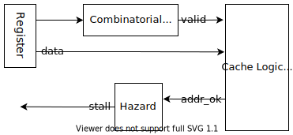
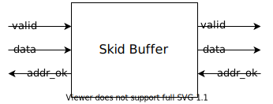
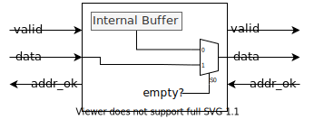

# 实验 3b：接入流水线

完成缓存的模块测试后，你的 L1i/L1d 应该能够无缝接入流水线了 `:)`

## 实验步骤

实验 3a 中，我们要求大家在 `DCache.sv` 里面实现 L1d。接下来将介绍接入流水线的步骤。

### L1i

我们提供的代码里面，L1i 是写在 `ICache.sv` 里面，并且直接使用 L1d：

```verilog
    // simply use DCache as ICache
    DCache proxy(
        .dreq(`IREQ_TO_DREQ(ireq)),
        .dresp(iresp),
        .dcreq(icreq),
        .dcresp(icresp),
        .*
    );
```

得益于 IBus 是 DBus 的子集，我们不需要做总线的转换。

<del>如果你精力旺盛，可以专门实现一个 L1i</del>。

### 替换转接器

在 `VTop.sv` 中，你需要将模块实例 `icvt` 和 `dcvt` 的模块名 `IBusToCBus`、`DBusToCBus` 分别换成 `ICache`、`DCache`。我们特意把缓存的模块接口做的和 `DBusToCBus` 这些总线转接器一样，方便我们继续使用 SystemVerilog 的 `.*` 语法。

```verilog
    ibus_req_t  ireq;
    ibus_resp_t iresp;
    dbus_req_t  dreq;
    dbus_resp_t dresp;
    cbus_req_t  icreq,  dcreq;
    cbus_resp_t icresp, dcresp;

    MyCore core(.*);
    /*IBusToCBus*/ ICache icvt(.*);
    /*DBusToCBus*/ DCache dcvt(.*);
```

### 处理地址映射

然而，单纯将总线接口替换掉还不够，因为并不是所有的内存区域都是可以被缓存的。一类是访问外设，显然我们不希望写入 UART 设备的字符要等到对应的 cache line 被替换掉时才发出。此外，这些外设可能也不支持突发传输。

那我们怎么知道可不可以缓存呢？MIPS 规范将内存空间划分为了若干段：


上图左侧是每个段的名称（例如 `useg`、`kseg0`）以及对应的地址范围。右侧是段的属性，这些属性的意义如下：

* User/Supervisor/Kernel：访问这一段的最低权限。我们暂时可以不用管。
* Mapped/Unmapped：这一段内的地址是否需要经过 TLB 翻译。我们暂时不用实现 TLB，因此所有 mapped 的段也不用管。
* Uncached：这一段内的所有访存要求不能经过缓存。

先前我们做了 `kseg0` 和 `kseg1` 的地址翻译。这里可以看到，`kseg1` 内的访存是要求不能过缓存的，而 `kseg0` 是允许的。CPU 的重置 PC（`0xbfc00000`）是在 `kseg1` 的，这是为了避免缓存在机器起动的时候需要初始化。同时龙芯杯的 CONFREG 模块也是映射到 `kseg1` 内的（`0xbfaf0000`~`0xbfafffff`）。`kseg0` 和 `kseg1` 都映射到同样的物理地址区域上。

总而言之，你需要能够允许有不经过缓存的访存路径。**你需要自己思考该如何在 `VTop` 中处理这些事情**。一种思路是：

* 在缓存之前做地址翻译，地址翻译输出一个 `uncached` 信号表明当前访存的地址是否能经过缓存。
* 增加更多的访存接口，一些接到缓存，另一些直接使用 `IBusToCBus`、`DBusToCBus` 转为 CBus 接口。
* 最后把所有输出的 CBus 接口（最多应该有 4 个）用仲裁器合并为一个 CBus 接口输出。我们提供的 `CBusArbiter` 支持参数化（通过 `NUM_INPUTS` 参数），可以支持多于两个输入的仲裁。

另一种思路是直接在缓存内部决定是否经过缓存。

### 测试

完成上面的事情后，用 `test1`~`test3` 来测试你的 CPU。你应该能观察到接入缓存后这些测试花费的时间和周期数都少了很多。

\*我们推荐你用[性能测试](../project/task1.md)算算分。有缓存后应该能够得到比较好的分数了 `:)`

## \*优化缓存

接下来介绍几个简单的优化技巧。

### \*Skid Buffer

流水线和缓存的交互容易产生非常长的关键路径，例如：



上图展示了一种可能的关键路径：

* 访存阶段发出请求。在发请求前需要做一点组合逻辑判断是否需要发出请求（`valid`）。
* 缓存搜索请求的地址是否在缓存中，并由此决定 `addr_ok`。
* 流水线根据 `addr_ok` 决定是否需要阻塞，产生 `stall` 信号。

`stall` 信号需要跨过多个流水线阶段，所以往往走线延时比较长。这里的问题主要出在握手信号（`valid` 和 `addr_ok`）之间有组合逻辑。Skid buffer 可以缓解这个问题。



Skid buffer 是插入在总线之间的。它的效果是切断 `valid` 和 `addr_ok` 之间的组合逻辑。实际上 skid buffer 类似于一个长度为 1 的队列。在 skid buffer 内部有一个缓冲区：



* 如果缓冲区不为空，发送缓冲区内的请求。否则发送流水线的请求。
* 当流水线的请求在当前周期不能发出时，可以将其缓存。
* 当内部缓冲区被占用时，流水线一侧的 `addr_ok` 设为 0，从而阻塞流水线。
* 当缓存一侧的 `addr_ok` 为 1 时，请求完成，可以清空内部缓存区。

这里最重要的一点是，只要内部缓存区为空（`empty` 信号），skid buffer 就能将流水线一侧的 `addr_ok` 拉起，而不用关心缓存一侧的 `addr_ok` 是否为 1。`empty` 使用一个寄存器存储。这样就能把流水线一侧的 `valid` 和 `addr_ok` 之间的组合逻辑切开。同时，我们可以看到整个过程不需要额外的时钟周期。

这里有一个参考实现：[RequestBuffer.sv](https://github.com/NSCSCC-2020-Fudan/FDU1.1-NSCSCC/blob/master/cache/src/util/RequestBuffer.sv)

### \*利用 WRAP 突发传输

缓存从内存读取 cache line 的时候不一定需要从 cache line 的第一个字节开始读取。利用 WRAP 突发传输，可以从 cache line 的任意位置开始读取。如果流水线访存地址的偏移量不是在 cache line 的起始位置，那么利用 WRAP 突发传输，我们可以从访存地址的偏移量处开始突发传输。那么当第一个数据从 CBus 返回时，就能直接将这个数据返回给流水线。这样流水线就不用等待整个突发传输完成了。

### \*非阻塞缓存（Non-Blocking Cache）

更进一步，对于正在读取的 cache line，如果访存地址的偏移量对应部分的 cache line 已经读取到了，那么可以直接返回。此时可能需要维护一个 bit 数组记录 cache line 的哪些地方已经读到了。

### \*后台写回

当 cache line 被写回时，可以不用阻塞住整个缓存。只要流水线访存的 cache line 还在缓存内，缓存就应该能继续服务。

## 实验提交

**本次实验和实验 3a 一起提交**。

### 通过标准

* 上板通过 `test1`、`test2` 和 `test3` 的测试。

### 截止时间

**2021 年 5 月 10 日 12:00**

## \*思考题

1. 文档中描述的 skid buffer 没有把流水线一侧的 `valid` 和缓存一侧的 `valid` 之间的组合逻辑切开。你有什么改进办法能把这两个信号之间的组合逻辑切开吗？这样做会有什么代价吗？
2. 张三设计了一个流水线阻塞机制：相邻的流水线阶段 X 和 Y 间有一对握手信号 `valid` 和 `ready`。阶段 X 在阶段 Y 之前。`valid` 表示阶段 X 已经执行完成，可以进入到阶段 Y。`ready` 表示阶段 Y 已经执行完成，阶段 X 的数据可以进入。
    * 假设流水线只有最后一个阶段可能需要多个周期，其余阶段只需要一个周期。请说明最后一个阶段该如何阻塞第一个阶段的执行。这之间握手信号的延时如何？
    * 如何减少上一问中握手信号的延时？
3. 如果你实现了 skid buffer，请尝试模仿实验 3a 中的方式，为你的 skid buffer 编写单元测试。
