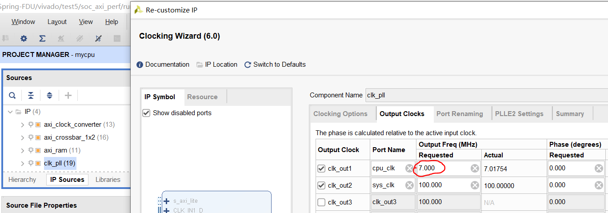
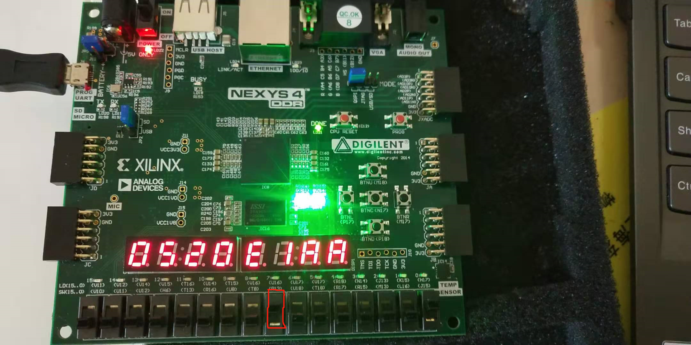

# 挑战课题
## 方向一：流水线性能优化

> 预备条件：通过 `test1`、`test2`、`test3`；未实现的指令 decode 为 `NOP`。

你将升级你的流水线架构，以获取更高的性能。

### 通过标准

* 上板 `test1`、`test2`、`test3` 显示两个绿灯，多次 reset 后仍显示两个绿灯。
* 上板 `test5`，时序无违例。

### 评分标准

* 上板 `test5`，调整开关以运行十个测试，将七段数码管读数记录在 `test5_score.xls` 中（已上传至 eLearning），得到综合性能分。

### 操作步骤

打开 `test5` 的 Vivado 工程，导入源文件后，你可以调整你的时钟频率。

在 “IP Sources” 中，打开 `clk_pll`，点击 “Output Clocks”，修改 `cpu_clk` 的值（上图红圈的内容）为你期望的时钟频率。除了这个值，该 IP 核的其他信息均不允许修改。

生成 bit 文件后，检查是否出现时序违例：

检查上图红圈的值，不允许为负值。图中是合法值。如果出现负值，请降低你的时钟频率。如果是正值，你可以增加时钟频率，以获得更高的分数。

> TIPS：如果你想知道你的 CPU 合法的最高时钟频率，请将时钟频率调整至一个非常高的值 $F$，确保出现时序违例。生成 bit 文件后，假设 WNS 为 $-t$ ns（$t > 0$），那么可以通过以下公式估算最高时钟频率：
>
> $$ f_{\max} = {1000 \over 1000 / F + t} $$
>
> 其中 $F$ 单位为 MHz, $t$ 单位为 ns。

上板后，先将所有开关往下调，**并把编号为7的开关往上调**。然后，调整右侧的四个开关，让它们表示十进制数 1 到 10（对应十个测试）。

上图为 RefCPU 在 7MHz 的频率下，右侧四个开关表示十进制数 1 时的上板现象（红框处的编号为7的开关向上调）。七段数码管会有一个读数。如果结果为两个绿灯，则将十个测试的读数依次记录到 `test5_scoce.xls`（文件已上传至 eLearning，在 “`实验部分`” 目录下）里。如果某个测试的结果为红灯，该项成绩填 0。

上图是 RefCPU 在 7MHz 的频率下，10 个测试的读数。填写完读数后，把表格中的时钟频率改成你 CPU 的时钟频率。图中数据所用的 bit 文件已上传至 eLearning，路径为 “`实验部分/refcpu_test5.bit`”。

### 提交内容

待定

### 截止时间

待定
