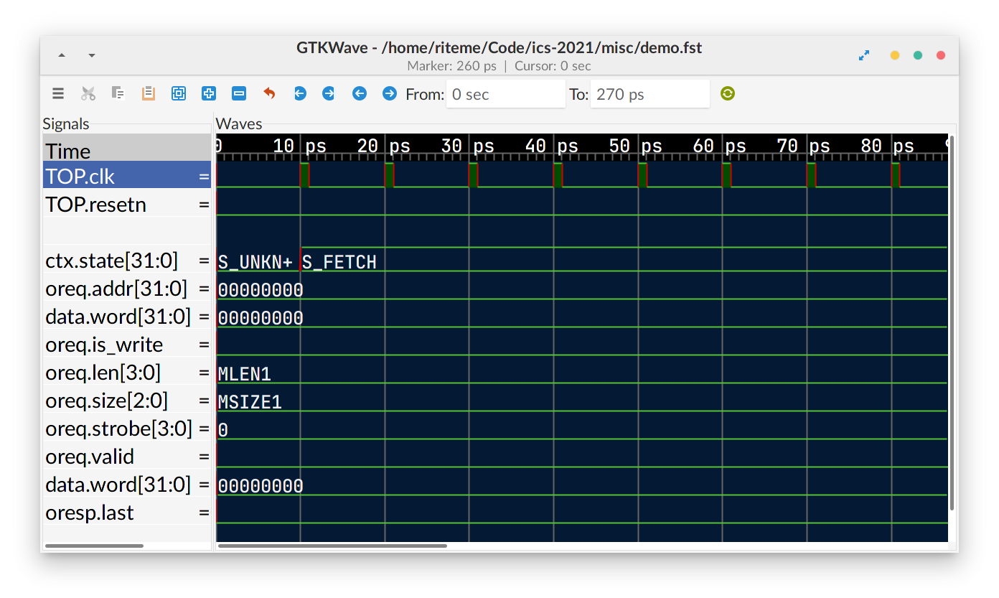
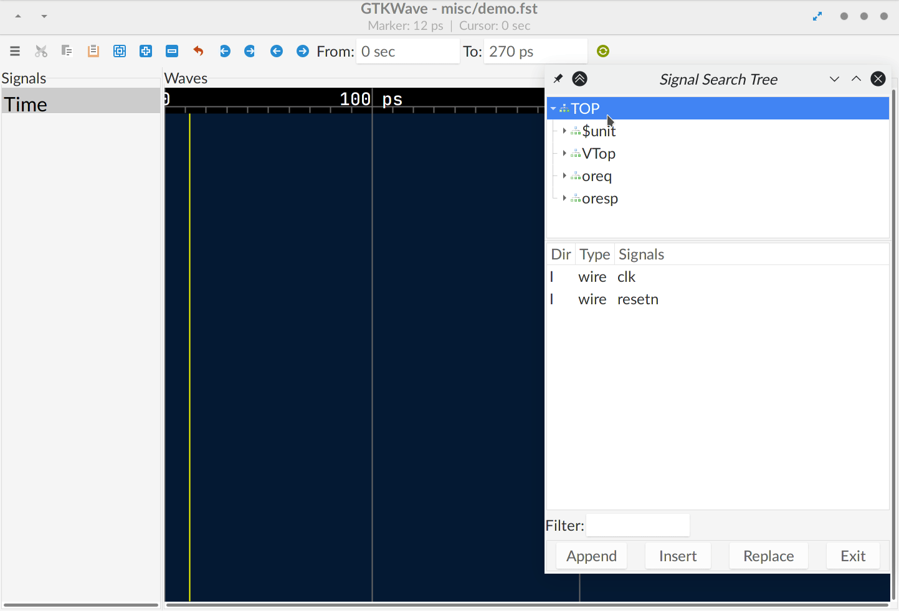

# 使用 GTKWave

打开样例波形图文件：

```shell
gtkwave misc/demo.fst
```

一开始面板上是没有信号的。另外有一个文件 `misc/demo.gtkw` 是与之相关联的配置文件，也可以直接打开：

```shell
gtkwave misc/demo.gtkw
```



## 添加信号

当你想加入更多的信号时，点击主菜单中的 “Search” → “Signal Search Tree”（或者使用快捷键 Shift+Alt+T 呼出）。之后会看到下面的窗口：


（这个窗口貌似有 BUG，第一次打开后关掉再重开，就展开不了结构树了...）

你也可以用 “Search” → “Signal Search Regexp” 来用文本搜索信号名。

## 生成新的波形图

我们的 Verilator 仿真程序一般支持使用 `--fst-tract`/`-f` 参数来指定 FST 波形图保存的位置。例如：

```shell
make vsim -j VSIM_ARGS="-f ./build/trace.fst"
```

将会在 `build` 目录下生成一个名为 `trace.fst` 的波形图文件。之后可以直接用 GTKWave 打开。

## 配置

开学在寝室无所事事？请阅读[ GTKWave 用户手册](../misc/external.mdl#其它)：<i class="fa fa-file-pdf-o"></i> GTKWave 3.3 Wave Analyzer User's Guide。

不想折腾？请将下面的内容写入 `~/.gtkwaverc`：

```plaintext
# 选择字体
#fontname_signals Lato 16
#fontname_logfile Lato 16
#fontname_waves JetBrains Mono Medium 14

# 快捷键
# “x” 新建一个 marker，“z” 删除一个 marker，“c” 删除所有 marker
accel "/Markers/Drop Named Marker" x
accel "/Markers/Collect Named Marker" z
accel "/Markers/Collect All Named Markers" c

fill_waveform 1
hide_sst 1
hier_grouping 1
hier_max_level 2
left_justify_sigs 1
use_fat_lines 1
use_roundcaps 1
wave_scrolling 1
disable_mouseover 0
highlight_wavewindow 1
splash_disable 1
color_back 041933
color_0 54c231
color_1 54c231
color_vbox 54c231
color_grid 666666
color_trans cc0000
color_vtrans cc0000
color_value eeeeee
color_umark f9fd01
enable_horiz_grid 0
page_divisor 4
```

## 示例



（上面演示中使用的是 GTK3 版本的 GTKWave）

## 为什么要用 GTKWave？

GTKWave 看起来挺土的，而且貌似有很多 BUG...

因为没有其它软件了。开源的波形图浏览器只有这一个能打的 `:)`
