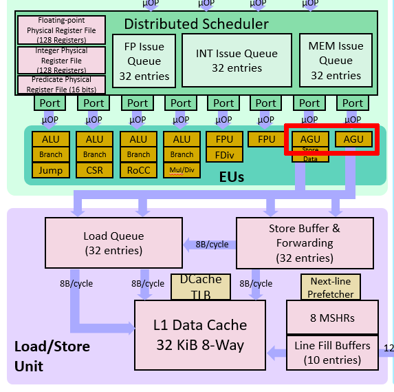

# 方向二：访存性能优化

实验 3 实现了基本的 cache 后，就可以开始在访存这块挤牙膏了。

## Uncached 访存

MIPS 架构中，`kseg1` 是 uncached 的。CPU 启动时和访存外设的时候都会从 `kseg1` 访问。以 UART 字符设备为例，它的访存显然是不能乱序、不能缓存、不能合并 store、不能 store 往访问同一个地址的 load 做转发的。因此 `kseg1` 内的访存只能按照顺序一个一个来。这极大地限制了访存的优化空间。

大多数情况下，我们还是能用 store buffer 消除掉等待 store 的 `data_ok` 的延时。但因为 load 不能乱序到 store 前面，因此 load 必须等待 store buffer 为空才能进行。一些乱序执行的流水线会选择把 load 也加入到 store buffer 内，这样可以同时处理多个 load/store。

**问题**：会有不能使用 store buffer 优化的外设吗？

> **ARMv8 中的内存类型和属性（memory types & attributes）**
>
> 与 MIPS 相比，ARM 中的内存分类更加细致。以 ARMv8 为例，ARMv8 也使用 memory-mapped peripherals。首先内存被分为 normal memory 和 device memory。Normal memory 和大家熟知的 RAM 类似，而 device memory 一般是映射到外设的内存。
>
> Normal memory 有 shareability 和 cacheability 两种属性。Shareability 和缓存一致性协议相关，这里不做过多讨论。Cacheability 是用来指示是否经过缓存，和 MIPS 中的 cached/uncached 类似。
>
> Device memory 有三种属性：
>
> * Gathering：多个 load/store 能够被合并成一次 transaction？
> * Reordering：能否乱序？
> * Early Write Acknowledgement：store 能否提前返回？
>
> 以上只是一个简单的介绍。有兴趣的同学可以翻阅 [“Arm Architecture Reference Manual - Armv8, for Armv8-A architecture profile”](https://developer.arm.com/documentation/ddi0487/latest/) 的 B2.7 小节。
>
> **问题**：这些属性是怎么指定到对应的内存区域上的呢？


## Cached 访存

经过 cache 的访存是优化的重点。访存性能指标主要有延时、带宽这两方面。

### Pipelined Cache

当 cache 的逻辑变得复杂以后，加上大容量 cache 访存的延时，如果要求 cache 单周期返回数据可能会拉低整个 CPU 的频率。经典的解决办法就是把 cache 切成多级流水线。这样虽然增加了访存的延时，但是提高了访存并行度，从而提高了 cache 的带宽。

可以参考 2019 年龙芯杯清华队伍的三级 cache 的设计：[“NSCSCC 2019 Final Report”](../misc/external.html#%E5%85%B6%E5%AE%83)。

### Address Generation Unit (AGU)

很多乱序流水线中都有地址生成单元（AGU）：


<center class="fig-caption">AMD family 19h processor</center>



<center class="fig-caption">RISC-V BOOM</center>

单独的 AGU 可以减轻 ALU 的计算压力。同时，这些微架构都会把 store 变成两个 μop：store-address 和 store-data。这在 Intel 的微架构图上体现得更清楚：


<center class="fig-caption">Intel Icelake</center>

上图中 “STA” 就是 store-address。这是因为 store 需要读两个寄存器。将 store 拆成两个 μop 可以增加指令并行度。Icelake 微架构对 load、store-address 和 store-data 各有一个 buffer。特别的，如果和当前 store 相关的两个寄存器都是可以直接读取，不会造成阻塞时，Icelake 会把 store-address 和 store-data 这两个 μop “macro-fuse” 成单独的 store。

### 使用 LUTRAM/BRAM

在实验三中已经介绍过 LUTRAM 了。LUTRAM 和 FF 寄存器相比，更加节省 FPGA 板上的资源。我们使用的 FPGA 板上还有存储密度更大的 Block RAM（BRAM）。下面两张图对比了 256KB 的 LUTRAM 和 BRAM 板上资源的占用：


与 LUTRAM 不同的是，BRAM 需要至少一个时钟周期的延时。这和实验 1 中的情况类似。此外，因为 BRAM 在 FPGA 板上的分布比较固定，而且间距比较大，所以 BRAM 的布线延时不一定比 LUTRAM 优秀。

我们在 `source/ram/BRAM.sv` 中提供了一个双端口 BRAM 的封装。你也可以直接使用 Xilinx 的 `xpm_memory_*` 系列的 XPM 模块。XPM 模块的使用请参考：[“UltraScale Architecture Libraries Guide”](../misc/external.html#soc-%E9%83%A8%E5%88%86)。

我们已经把 `xpm_memory_*` 模块移植到 Verilator 上了，以方便你使用 Verilator 仿真。如果你想在 Verilator 上启用 XPM 模块，请在运行 `make vsim` 命令的时候加上 `WITH_XPM=1`。由于 Xilinx 提供的 XPM 仿真模型的 SystemVerilog 代码用到了很多低版本 Verilator 不支持的语法，所以需要较高版本的 Verilator（≥ 4.108）才能成功编译。

### Banked Cache

RAM 模块一般不会有很多端口。即便是 BRAM，也只会提供两个独立的端口。当多个端口同时写入同一个位置时，会发生冲突。如果没有仲裁，此时就有可能损坏数据。在仿真中，BRAM 发生读写冲突时，数据都会变成 `X`，以提醒你避免写冲突的出现。

为了增加 cache 的访存并行度，cache 需要提供更多的端口。一种方法是使用 banked RAM。我们可以把一条 cache line 分别存储在多个 RAM 上：


上图中，假设 cache line 大小是 64 字节。我们建立 4 个 bank，每个 bank 存储 32 位（4 字节）字宽的数据。按照交替的方式将每条 cache line 划分到四个 bank 上。如果 RAM 模块有一个读写口，那么此时相当于 cache 提供了 4 个读写口。

Bank 方式需要处理端口冲突：如果两个访存同时访问同一个 bank，需要进行仲裁。而上面之所以按照交替的方式来组织 bank，是因为减少连续读写 4 字节大小的数据时的 bank 冲突。

**问题**：如何快速确定访存地址对应的 bank？

**问题**：如果是连续读写单字节的数据（例如读写字符串），是否会有 bank 冲突？有什么缓解办法吗？

### Store/Fill/Victim Buffer

为了隐藏比较耗时的操作带来的延时，往往会引入各种各样的缓冲队列。

Store buffer 早在实验 2 就已经提及了，它消除了流水线上由 store 带来的阻塞。对 cache 而言，比较耗时的事情是从主存抓取 cache line（fill）和将 cache line 写回到主存中（victim）。我们也可以用缓冲来提高 cache 的访存并发度。

例如，当某个访存未命中时，我们可以把它放入 fill buffer。之后 cache 可以继续服务其它的访存。这也就是所谓的 “hit under miss”。支持这种功能的 cache 一般称为非阻塞 cache（non-blocking cache）。同样的，如果某次访存触发了 dirty 的 cache line 的换出，我们同样可以把这个 dirty 的 cache line 放入 victim buffer，以避免其阻塞后面的访存。

这需要缓存有多个读写端口。之前的分 bank 技术已经解决了这个问题。

**问题**：顺序发射的流水线能否利用上 fill buffer 带来的 “hit under miss” 特性？

### Early Store

当 store 操作 cache miss 时，即使新的 cache line 还没有完全从主存抓取过来，store 也是可以执行的。需要避免主存过来的数据覆盖掉已经完成的 store 的数据的情况。

### Store Forwarding/Combining

和流水线上的转发类似，store 的数据可以直接转发到 store 后面的 load。

对同一个地址的连续的 store，后面的 store 数据可以直接覆盖掉前面 store 数据。有些时候可以考虑将多个小数据合并成一个大数据来写入（例如 4 个单字节的写入合并为 1 个 4 字节的写入）。

这些优化一般是由 store buffer 实现的。

### Prefetch

预取（prefetch）是流水线隐藏访存延时的有力手段。目前大部分商用乱序核都有预取的能力。

预取分为硬件预取（hardware prefetch）和软件预取（software prefetch）。MIPS 架构提供了 `prefetch` 指令来做软件预取。

通常在 cache 空闲（比如 fill buffer 为空）时进行预取。预取需要根据之前的访存记录，判断之后访存会访问哪条 cache line。Intel 的微架构支持识别等距（stride）的访存模式，无论是顺序还是倒序，然后计算出下一次访存的 cache line。这是针对顺序访存的优化。对于乱序访存，如果 cache 发现这些访存都在某个小范围内，比如 4KB，cache 也可以考虑把这 4KB 的内存全部载入到 cache 中。

**问题**：众所周知，顺序访存对 cache 是非常友好的。考虑计算数组总和的 C 代码：

```c
int sum(int n, int *a) {
    int i, s = 0;
    for (i = 0; i < n; i++) {
        s += a[i];
    }
    return s;
}
```

请问硬件预取在 `sum` 函数的 `for` 循环中是否发挥了作用？

**问题**：你能举出一个使用软件预取来优化的例子吗？

### 自定义总线/SoC

在前几次实验中，IBus 总线宽度只有 32 位，这将成为超标量流水线的瓶颈。你完全可以自定义流水线和 cache 之间的总线，以满足流水线的性能需求。比如，你可以扩宽 IBus 总线，或者提供多个访存接口。

同样的，龙芯提供的 SoC 用的是 32 位的 AXI 总线，这也极大的限制了内存带宽。可以考虑自行修改 SoC 部分，增加 AXI 总线宽度。现代计算机的 DRAM 虽然延时很高，但是带宽也会很大。

此外，也可以考虑设计一个二级缓存，然后在一级缓存和二级缓存之间提供大带宽的总线。

### Non-Temporal Access

“Non-temporal” 是程序员提供给 CPU 的 hint，表示这次访存访问到的部分在接下来的一小段时间内不会再次被访问到。例如，把矩阵初始化为全 0，很可能这个矩阵不会马上就用上。当 CPU 发现访存 cache miss 并且有这样的 hint 时，会考虑直接访问主存，而不将对应的 cache line 读取到 cache 中。这样可以避免把其它更有用的 cache line 换出。或者是给 non-temporal 的访存专门准备一个单独的 cache line，以合并连续的写入，从而能够利用主存的突发传输。

这种 hint 貌似是要有特定的指令编码的。x86 和 ARMv8 中都有专门的 non-temporal 访存指令，特别是 x86 的 SSE 指令。我暂时不知道怎么在 MIPS 中实现这种想法。

## 其它

由于龙芯杯的性能测试比较小，所以 32KB 的一级缓存基本上都能达到 99% 的命中率。为了能够测试出各种优化策略的效果，我们建议你使用 2KB 或者 4KB 的一级缓存来做测试和性能分析。
